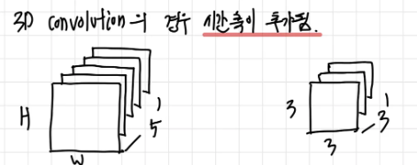
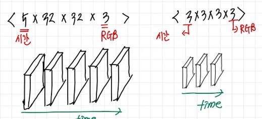
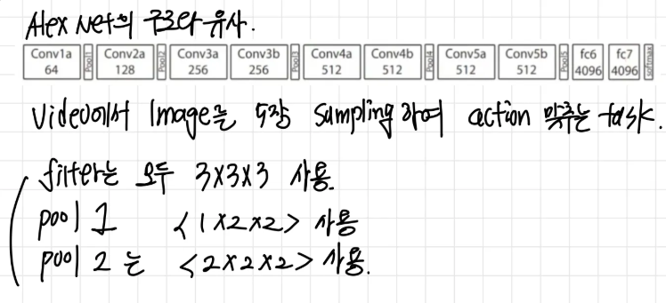
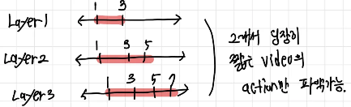
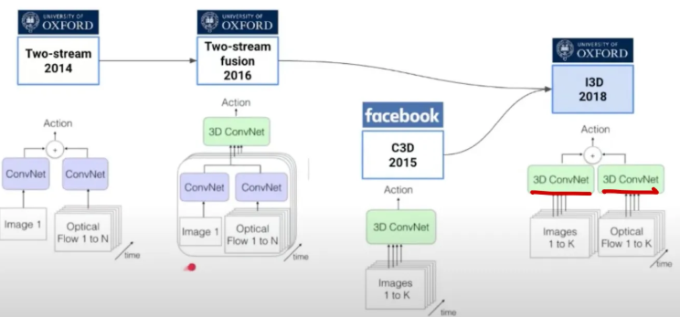
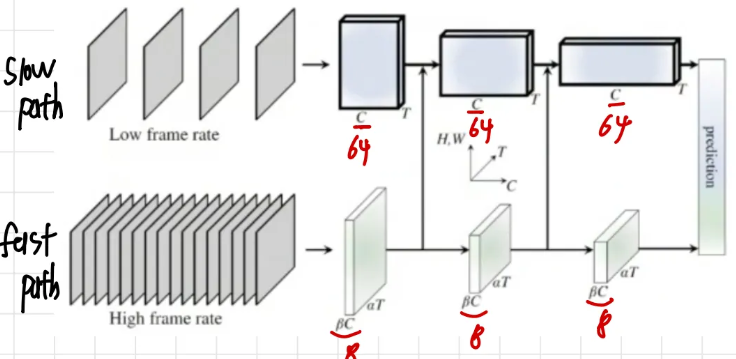
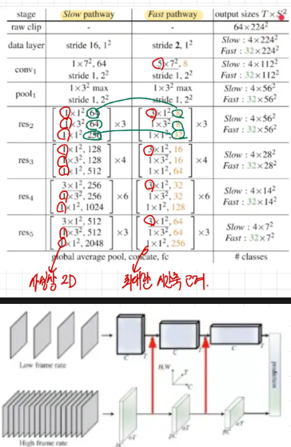

앞의 two stream논문과는 다르게 페이스북 (메타)에서는 짧은 동영상에 대해서 optical flow를 사용하지 않고 오직 CNN모델을 사용하여 비디오의 문제를 해결하고자 노력하였습니다.

그래서 CNN모델을 2D에서 3D로 확장된 3D convolution연산에 대해 알아보겠습니다.

<aside>

# 3D convolution

</aside>

기본적으로 3D 에서는 간단하게 2D에서 시간축으로 차원이 늘어난 형태를 가지게 됩니다. 
Gray Scale의 이미지에 대해서 이를 표현해 보면 다음과 같이 표현해볼 수 있습니다.

그래서 예를들어서 우리가 5개의 프레임을 가진 32크기의 동영상이 있다고 가정을 해봅시다. 그러면 입력의 크기는 < 5,32, 32 > 가 됩니다. 그리고 우리가 필터로 총 3개의 프레임을 동시에 본다고 가정하게 되면 필터 크기는 <3, 3, 3 > 을 갖게 됩니다. 그렇다면 위의 식을 통해서 convolution 연산을 하면 어떻게 될까요? 

바로 다음과 같은 결과를 얻을 수 있습니다. 간단하게 그냥 시간축으로의 연산을 추가함으로 3차원 연산을 진행할수 있습니다.

그렇다면 이미지가 그레이가 아니라 RGB라면 아래 그림과 같이 표현해볼 수 있습니다.

우리는 여기서 < 시간축, 세로, 가로, 채널 > 순서대로 표기하기로 약속을 합시다.

<aside>

# C3D

</aside>

매우 간단한 아이디어 입니다. Alex Net 모델을 그대로 가져와서 단순히 3차원 연산을 진행하도록 모델의 아키텍처를 살짝 변경한 논문입니다.

### <한계

다음과 같이 stride = 2로 설정하여 레이어를 쌓을 떄마다 수용영역이 오직 2개의 프레임을 더 볼수 있어 아무리 깊이 쌓아도 긴 비디오에 대해 다루기 어렵게 됩니다.

그리고 추가적으로 연산량이 많고 여전히 사람이 직접 특징을 추출하는 방식이 보다 효과적이라고 합니다.

<aside>

# R3D (3D Resnet) & R(2+1)D

</aside>

위 논문의 아키텍처를 단순히 ResNet으로 변경하여 적용한 모델입니다.

그리고 R3D논문의 파라미터수가 많은 문제를 해결하기 위해서 inception 연산을 진행하는 경우 ResNet에서 사용한 트릭 처럼 시간축과 공간축을 분리하여 학습을 유도하기 위해서 ( 3, d, d ) 를 바로 학습하는 게아니라 ( 1,d, d) → (3, 1, 1) 처럼 각각의 차원을 고정시킨 후 학습 시켜 효율성및 선응을 향상 시킨 것이 바로 R(2+1)D 논문입니다.

<aside>

# T3D

</aside>

해당 논문에서도 단순히 아키텍처를 DenseNet으로 바꾸고 아래와 같이 2가지 아이디어를 추가했다고 합니다.

1. DenseNet 모듈에 inception 모듈을 추가하는 아이디어
2. 공간적 패턴은 2D의 pretrain 모델에서 가져와서 2D 모델과 3D모델의 중간 feature map을 비교하여 3D모델의 중간 특징맵이 2D 모델의 중간 특징맵을 잘 따라할수 있도록 (distillation) 손실함수를 추가하였다고 합니다.

# I3D

그리고 드디어 위에서 봤던 3D convolution + two stream 방법을 합친 모델이 등장하였습니다.

I3D의 경우 backbone을 google을 사용하였습니다. 그리고 여전히 optical flow를 사용하였습니다.

해당 논문에서는 ***optical flow가 결국에는 두 프레임사이의 관계를 파악***하게 되어 비디오를 이해하는데 도움이 되어 이를 사용하는 것이 보다 유용하다는 의견을 남겼습니다.

<aside>

# SlowFast Network

</aside>

페이스북(메타)에서는 optical flow를 사용하지 않으면서도 더 좋은 성능을 내기 위해서 공간정보와 시간정보를 따로 학습하는 모델을 생각해 냈습니다

다음과 같은 모델 구조를 가지고 있습니다.

slow path : stride 를 크게 주어서 비디오에서 이미지를 띄엄띄엄 가지고 오게 됩니다. 이렇게 되면 결국 자연스럽게 이미지의 변화를 학습하기에는 어렵고, 단순히 이미지의 공간정보를 학습하도록 유도할 수 있습니다.

fast path : stride를 작게 주어 이미지의 변화를 학습하도록 하였습니다. 

이렇게 2개의 path를 통해서 모델은 공간정보와 시간정보를 분리하여 학습할수 있게 됩니다. 하지만 여기서 fast path의 경우 많은 이미지가 들어오기에 더 많은 연산량을 필요로 합니다. 그래서 둘의 연산량을 맞춰주기 위해서 fast path의 차원 크기를 slow path의 1/8으로 줄여서 학습했다고 합니다.

그리고 추가적으로 두 path 사이의 정보 교환이 이뤄나면 조금더 잘 학습할 수 있지 않을까? 라는 아이디어에서 새로운 across pathway를 구축했는데, 이때 차원과 크기를 맞추기 위해서 간단하게 차원을 샘플링 하거나, concat 하는 방식으로 구현했지만 , (fast path → slow path)로의 연결만 효과가 있었다고 합니다.

<aside>

# X3D

</aside>

이는 위에서 언급한 SlowFast network의 여러가지 값들 예를 들어 스트라이드값, 차원크기, 특징맵 크기등을 하이퍼 파라미터로 설정하고 , 모든 값을 모델이 직접 최적의 값을 찾도록 설정한 모델입니다. “Auto ML”을 활용하여 최적의 모델을 찾아낸 논문입니다.