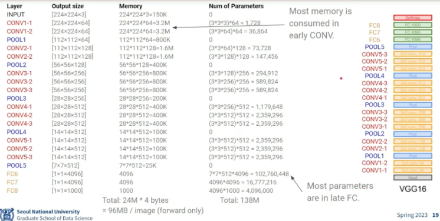
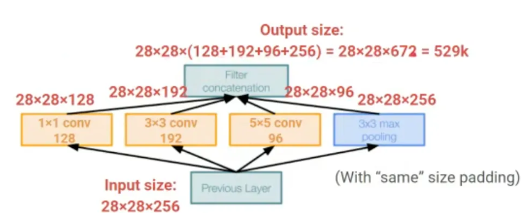
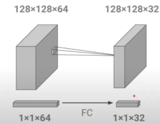
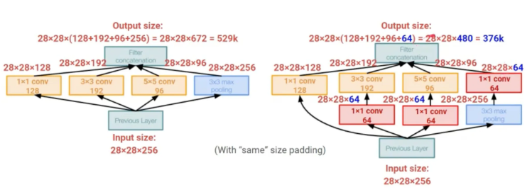
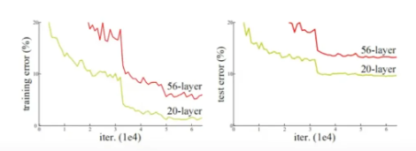
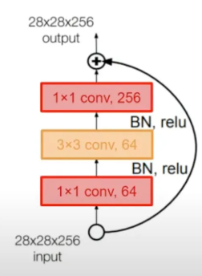

용해서 모델을 구현함. 3 x 3 크기의 filter를 여러개 사용하면 모든 크기의 filter사이즈를 표현할 수 있다. 그뿐 만 아니라 더욱 작은 파라미터를 필요로 한다.
Layer를 여러개 쌓을 때 마다 더 많은 activation function을 통과하게 된다. 그래서 더 많은 Non Linearity를 제공하기에 3 X 3 필터를 여러개 쌓아올리는게 VGG의 핵심 아이디어 입니다.

다음과 같이 Memory cost 자체는 초반에 많이 발생하며, 학습해야하는 파라미터의 수는 후반으로 갈수록 증가하는 추세를 확인해 볼 수 있습니다.

## googLeNet

기존의 모델들은 하나의 층에서 하나의 conv layer를 사용했기에 정해진 수용영역이 고정됩니다. 그래서 초반에는 작은 물체들을 학습하고, 뒤로 갈수록 점점 넓은 수용영역이 생기기에 더 큰 물체를 관찰하게 됩니다.
하지만 이미지의 크기가 작고 복잡할수 있고, 크기가 크고 단순한 객체가 존재하기에, 한번에 다양한 수용영역을 학습하기 위해서 “inception module”을 제안하였습니다.

모든 모듈들은 동일한 이미지의 크기를 유지하기 위해서 padding을 추가하였습니다.
서로 다른 크기의 수용영역을 갖는 모듈들이 각각 학습을 진행하고 이들을 channel wise하게 합쳐지게 됩니다. 그래서 하나의 층에서 다양한 수용영역을 볼 수 있기에 이미지의 객체들을 더 잘 포착하겠지만, 연산량이 엄청나게 증가한다는 단점이 존재합니다.

그래서 1 X 1 convolution 을 사용해서 이미지 사이즈를 줄이지 않고 dimension reduction을 하여 연산량을 줄이고자하였습니다. ( 1x1 conv는 결국 각 픽셀별로 64차원을 32차원으로 줄여주는 FC layer 역할 ) 

그래서 다음과 같이 파라미터의 연산량을 줄여줄 수 있었습니다.

그리고 FC Layer를 없애기 위해서 googLeNet에서는 average pooling을 진행하였고, 마지막의 단 하나의 fc layer를 통해 class갯수를 맞춰주었습니다. 위와 같이 FC layer를 사용하지 않고 average pooling을 사용했기에 훨씬 적은 파라미터를 사용해서 구현이 가능했다고 합니다

### GAP ( global average pooling)

GAP의 경우 FC를 사용하지 않고 최종 결과를 도출하는 방법입니다. 그래서 만일 feature map의 크기가 ( H , W , C ) 라고 한다면, 최종적으로 ( 1, 1, 클래스 수 ) 로 만들어서 각 차원들이 하나의 클래스를 대표하는 score를 얻을 수 있다고 합니다. 그리고 추가적으로 굳이 (1,1,클래스 수) 가아니더라도 ( N, N , 클래스 수 )로 만들어서 각 채널의 평균을 해당 클래스의 점수로 사용할 수 있다고 합니다.

## ResNet

resnet의 실험 결과 아래와 같이 모델의 깊이가 더 깊은 모델이 train, test 에러 모두 더 높은 것을 보였습니다. 그래서 이는 overfitting이 아니라 단순히 deep한 모델의 성능이 낮다고 판단할수 밖에없습니다.

그래서 ResNet 논문 저자들은 아래와 같은 가정을 하였습니다.

가설  : 현재 사용하는 최적화 방법이 깊은 모델에 더 분리하다 ( 깊은 모델을 학습하기에 더 어렵다 ) 

그래서 다음과 같이 identity를 연결해줍니다. 

이전 모델들은 x → H(x)를 학습했다고 한다면 ResNet의 경우 X가 그냥 흘러갑니다. 그리고 H(x)와 x가 다르다면 차이만큼을 학습하도록 합니다. 이러한 방식을 사용해서 gradient vanishing없이 152층을 쌓을수 있었습니다.

이 또한 많은 연산량을 필요로 해서 다음과 같이 1x1 conv를 추가해서 연산량을 줄였다고 합니다. 차원을 유지하기 위해서 2개의 1x1 conv를 사용했습니다. 그리고 중간 중간 Batch Norm과 ReLU를 사용했습니다.