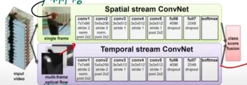
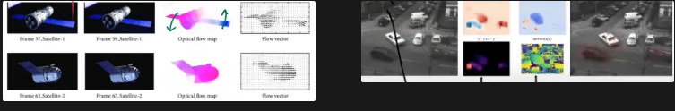
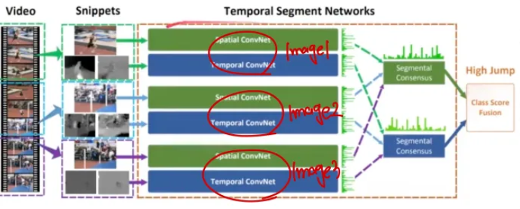

비디오 연구가 어려운 이유는 ***데이터 자체의 용량이 너무 크고***, 이미지 보다 학습해야하는 ***데이터가 복잡***하기 떄문입니다. 그리고 학습 시에도 비디오의 길이 만큼의 시간이 더 필요하게 됩니다.

그리고 데이터 자체를 마련하는것 또한 힘들며, 비디오의 저작권 또한 연구를 어렵게 하는 하나의 요인입니다.

<aside>

## 비디오 분석의 가장 첫 아이디어

</aside>

가장 처음 비디오를 분석하는 방법은 그냥 비디오 에서 하나의 이미지 ( Frame ) 만을 가지고 분류를 진행하는 것 입니다. 하지만 이러한 아이디어는 ***비디오의 Action 요소를 하나도 고려하지 못합니다***.

그래서 여러개의 이미지에 대해서 ***각각 CNN 모델을 돌린 후 이를 합치는 방식***으로 접근하게 됩니다.
이미지를 합치는 방식은 다음과 같이 2가지로 분류될 수 있습니다.

1. Score fusion : 각 이미지의 최종 값들을 합치는 방식
2. Feature fusion : 특징맵을 합친 후 몇개의 레이어를 추가하여 값을 얻는 방식

그리고 Feature fusnion에서도 언제 특징맵을 합치는지에 따라서 Late Fusion, Early Fusion으로 구분할수도 있습니다. 

<aside>

## Two Stream Model

</aside>

공간적 정보와 시간적 정보를 배우는 CNN model을 각각 학습 시킨 후 이를 합치는 모델입니다.

해당 논문이 나왔을 상황에는 연산장치의 부족으로 인해 우선 공간적 정보를 다루는 경우 비디오에서 1장의 이미지를 랜덤으로 샘플링하여 입력으로 사용하였다고 합니다. 그리고 시간축 정보를 학습하기 위해서는 Optical flow를 입력으로 사용하였습니다. 

Optical flow는 특정 픽셀이 다음 프레임에서 얼만큼 이동했는지를 나타내는 ***변화량***입니다. 그래서 다음과 같이 수직, 수평 방향으로 얼마나 이동했는지를 다음과 같은 그래프로 표현이 가능합니다.

그러면 Optical flow의 경우 기본적으로 시간축을 가지고 있기에 차원이 이미지 보다 큽니다. 그래서 우리는 해당 입력값을 CNN 모델에 넣기 위해서 하나의 이미지 처럼 처리해야하는데, 이떄 이를 단순히 L개의 프레임이 존재하는 경우 ***차원이 2L인 하나의 이미지 처럼*** 합쳐서 처리하였다고 합니다. 이렇게 처리하면 결국 1번 레이어의 차원수만 맞춰주면 CNN Model의 입력으로 사용할 수 있기 떄문입니다.

### Optical flow의 전제 조건

1. 동일한 픽셀은 이동 후 동일한 밝기를 갖는다 ( 충분한 fps라는 조건 하에 )
2. 픽셀이 순간적으로 너무 많이 이동하지 않는다.
3. 근접한 위치의 픽셀들은 동일한 객체를 나타낸다.

위와 같은 가정하에 우리가 optical flow를 구하여 사용하는데, 이는 간단하게 openCV라이브러리에 구현이 되어있다.

< 한계 > 

하지만 우리가 하나의 이미지만 사용하게 되면 해당 이미지가 비디오와 전혀 다른 이미지인 “False Label Assignment”문제가 발생합니다. 그리고 optical flow 자체를 저장하는데도 용량이 많이 차지하게 됩니다.

그래서 우리가 이를 조금더 개선하기 위해서 score를 합치는 방식 보다는 feature map을 합쳐서 FC레이어의 연산을 공통으로 하여 파라미터의 수를 줄이는 방법도 고안되었다고 합니다. 하지만 이때 중요한 것은 공간정보와 시간정보의 특징맵의 차원을 일치시키는 것이 중요하다고 합니다.

그리고 TSN ( temperal segment network ) 라는 모델이 나왔고 이는 위의 논문을 발전시켜 여러개의 이미지를 샘플링하고, Batch Norm등의 기법을 사용하여 성능을 개선 시켰다고 합니다.

그리고 Hidden Two Stream으로 Optical Flow의 연산을 없애기 위해서 모델의 입력으로 2장의 이미지가 주어지고 모델이 스스로 optical flow를 학습하여 시간적 패턴을 파악하여 End to End 학습이 가능한 모델이 나왔다고 합니다. 그래서 현재는 optical flow를 직접 계산하여 입력으로 넣어주기 보다는 모델이 스스로 학습하는 방향으로 모델이 발전하였다고 합니다.